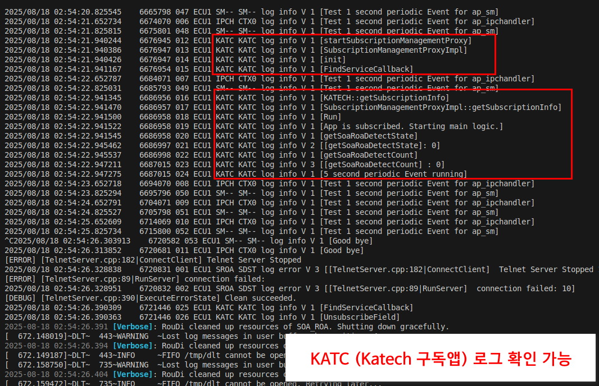

# SDV_example
SDV 구독앱 개발에 필요한 ARXML 및 레퍼런스 코드

### 필수 요구 사항
---
- **Linux/Ubuntu** 환경 (v. 22.04~)
- **Docker**
- **popcornsar PACON-IDE 최신 버전 (v 1.2.16)**

### 도커 빌드 환경 구축
---
**In git root folder**

`./popcorn.sh`

### Build Application
---
#### 1. 도커접속

`ssh popcornsar@localhost -p 41004`

password: 0 or edu!@#$(따로 도커 환경을 실행했을 시)

`docker exec -it edu_1.2.16 bash`

#### 2. 환경변수 설정

`source ~/sdv/SOURCE_THIS`

#### 3. 폴더 구조

sdv/src/eevp_main_machine/  
├── ap_app/ # 모비스 앱 모음  
├── subscription_app/ # 구독 서비스 앱 모음  
└── adaptive_autosar/ # Adaptive Autosar 모음  

#### 4. 빌드 전 구독 앱 심볼릭링크 생성

각 어플리케이션 폴더에 adaptive_autosar폴더로 이어지는 심볼릭링크를 생성한다.

도커 환경에서  
**eevp_main_machine 폴더 내**

`./sub_symbollink.sh
`
#### 5. 어플리케이션 빌드

5.1. 빌드 전 ARXML 설계

adaptive_autosar/arxml/eevp_reflect 이하 폴더들을 AutoSAR.io 프로젝트에 복사 후 작업  
앱 추가 시, adaptive_autosar/arxml/default_template에 있는 Template 파일을 복사 후 원하는 앱 이름으로 변경하여 추가  
ARXML 설계 완료 후 autoSAR.io 프로젝트의 gen_ara폴더를 eevp_main_machine/adaptive_autosar/gen/ 경로로 복사 (최신화)  

5.2.  빌드

<u>**option 1. 직접 빌드 방법**</u>

i) ap_sm 과 ap_ipchandler 는 필수적으로 빌드
(최초 빌드할 시에는 -c -p 옵션 필수 (-c는 초기화, -p는 바이너리 폴더 생성))

`bash ~/sdv/src/eevp_main_machine/ap_app/ap_sm/docker_build.sh -c -p`

`bash ~/sdv/src/eevp_main_machine/ap_app/ap_ipchandler/docker_build.sh`

ii) 구독앱 빌드 예) ap_intelligent_wiper 구독앱 빌드시

`bash ~/sdv/src/eevp_main_machine/subscription_app/ap_intelligent_wiper/docker_build.sh`

<u>**option 2. 간편 빌드 방법**</u>

`cd ~/sdv/src/eevp_main_machine/  `

build.sh 에서 빌드하고자 하는 modules 입력 및 주석 처리 후  

`./build.sh`

#### 6. 어플리케이션 실행

`cd $PARA_CORE/bin`

`./EM`

(~/sdv/에 test.sh 스크립트로 존재)

 

### 개발시 참고 및 유의사항  
---
#### 1. arxml 설계는 비디오 참고
https://drive.google.com/file/d/12CyRW6FuNO60p7GWbb7CrmrkrDJxB2Ml/view

#### 2. ap_katech 레퍼런스 코드
ap_katech 은 개발 및 제어기 구동 검증이 완료된 서비스입니다. ap_katech 은 roa 센서값에 따라 rear curtain 을 제어하며 ap_roa, ap_rearcurtain, ap_subscriptionmanager 서비스를 사용합니다. 해당 앱의 arxml 과 소스코드를 레퍼런스 삼아 개발하시면 편리합니다.

#### 3.  ap_subscriptionmanager 인터페이스 추가 필요
모든 구독앱은 해당 인터페이스를 통해 구독상태 (enable/disable) 상태를 가져와야 합니다.
코드 구현은 ap_katech 의 소스코드 부분을 참고하시고
arxml 설계는 pdf 파일을 참고하시기 바랍니다:
[사용자 매뉴얼 (PDF)](/readme_file/Eevp.Subscription.Service-v21-20250818_125207.pdf)

#### 4.  구독SW FunctionGroup 설정 필요 
-  FG 은 구독앱 설치/삭제/업데이트 시 SW 프로세스 실행/종료를 위함
- Adaptive AUTOSAR Flatform에서는 FunctionGroup에 지정된 프로세스들이 함께 실행/종료됩니다
- 상호 의존성을 줄이고자 FunctionGroup을 사전에 미리 지정(SFG01~SFG20)해두었으니 ARXML 설계 시 포함만 해주시면 됩니다
- 다른 SW와 FunctionGroup이 겹치지 않도록 <u>**아래 테이블 업데이트**</u>🙌 부탁드립니다.

| FG| 구독앱| 담당기관|
| --- | --- | --- |
| SFG01| KATECH  (roa-리어커튼) | 한자연 |
| SFG02 | IntelligentWiper | 한자연 |
| SFG03 | ServiceCreator | 한자연 |
| SFG04 | | |
| SFG05 | | |
| SFG06 | | |
| SFG07 | | |
| SFG08 | | |
| SFG09 | | |
| SFG10 | | |

#### 5. 작업 브랜치
/dev/(구독앱) branch에서 작업 부탁드립니다.

#### 6. Pull Request
도커 환경에서 구독앱 구동 테스트까지 완료 후 <u>**main 브랜치로 PR**</u>🙋‍♀️ 보내주세요.
도커 환경에서는 아래와 같이 log 확인이 가능합니다:
예시)ap_katech 빌드후 ./EM 실행시 아래와 같은 로그 출력

